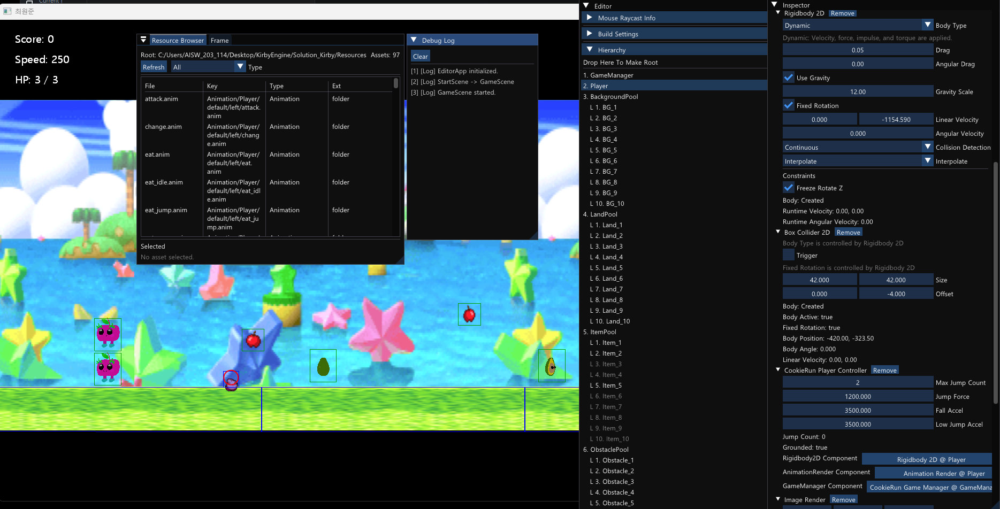
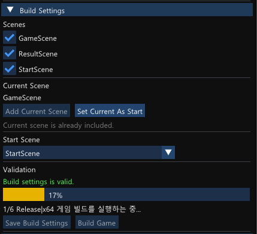

# KirbyEngine

KirbyEngine은 C++로 직접 만들고 있는 미니 게임엔진 + 에디터 프로젝트입니다.

## 핵심 구현 요약

- C++17 / Win32API / DirectX9 기반 미니 게임엔진 및 에디터
- GameObject-Component 구조와 parent-child 계층 구조 구현
- JSON 기반 SceneData 저장/로드 및 컴포넌트 복원
- EditorApp / GameApp 실행 분리
- EngineFrameworkDll / EngineEditor / KirbyGameDll 구조 분리
- Box2D 기반 Physics2D 및 Collision / Trigger 이벤트 전달

## 1. 프로젝트 한눈에 보기

현재 솔루션의 큰 구성은 아래와 같습니다.

- `EngineFrameworkDll`
  - 공통 엔진 기능이 들어 있는 DLL
  - 렌더링, SceneData 저장/로드, GameObject/Component 구조, Physics2D, 입력, 기본 에디터 연결부 포함
- `EngineEditor`
  - 에디터 전용 코드를 따로 분리하기 위해 만든 프로젝트
  - 아직 1차 분리 단계이며, 일부 editor 코드는 여전히 `EngineFrameworkDll` 안에 남아 있음
- `KirbyGameDll`
  - 게임별 사용자 컴포넌트, 사용자 액션, 테스트용 스크립트가 들어 있는 DLL
- `EditorApp`
  - 에디터 실행기
  - `EngineFrameworkDll + EngineEditor + KirbyGameDll` 조합으로 동작
- `GameApp`
  - 게임 실행기
  - `EngineFrameworkDll + KirbyGameDll` 조합으로 동작

## 2. 주요 기술

- C++17
- Win32 API
- DirectX 9
- ImGui
- Box2D
- FBX SDK
- MSBuild / Visual Studio 프로젝트 기반 빌드

## 3. 현재 구현된 핵심 기능

### 3-1. GameObject / Component 구조

- `GameObject + Component` 구조 사용
- parent-child 계층 구조 지원
- local / world transform 유지
- SceneData 저장/로드 시 parent-child 관계 복원

### 3-2. 에디터 기능

- Hierarchy
- Inspector
- ResourceBrowser
- BuildSettings
- Scene 저장 / 열기 / 새 Scene 만들기
- ImGui 기반 편집 UI
- Debug Log 창

### 3-3. Physics2D

- `Rigidbody2D`
- `Collider2D`
- `BoxCollider2D`
- `CircleCollider2D`
- `Physics2D::Raycast`
- Collision / Trigger 이벤트 전달

### 3-4. SceneData 저장/로드

- JSON 기반 SceneData 사용
- object / component / transform / camera / timeScale 저장
- 구버전 SceneData도 가능한 범위에서 계속 읽을 수 있게 유지
- 최신 SceneData 버전: `9`

### 3-5. 사용자 확장

- `KirbyGameDll`에서 사용자 컴포넌트 추가 가능
- Inspector 표시, 직렬화, 참조 복원 등도 사용자 컴포넌트 단위로 확장 가능
- 테스트용 컴포넌트와 샘플 컴포넌트도 함께 관리 중

## 4. 최근에 정리된 구조 변화

이번 정리에서 특히 큰 변화는 아래와 같습니다.

- `BuildEdit` -> `EditorApp` 이름 변경
- `BuildResultGame` -> `GameApp` 이름 변경
- `EngineFramework` -> `EngineFrameworkDll` DLL 구조로 변경
- plugin 표면 단순화
  - `RegisterGameContent(...)`
  - `GetName()`
  - `ReleaseGameContent()`
- `MainFrame` 생명주기 정리
  - `AppBootstrap`을 통해 실행 흐름을 더 분명하게 정리
- `Runtime -> Editor` 직접 include 일부 제거
  - `WindowFrame -> EditorSceneWorkflow` 직접 호출 제거
  - `RenderManager -> EditorRenderFacade` 직접 호출 제거
- `ReferenceFieldRegistry` 추가
  - Inspector에서 `GameObject` / `Component` 참조 필드를 등록 기반으로 그릴 수 있게 정리
- `Component`에 persistent `componentId` 추가
- registry 기반 reference field의 SceneData 저장/로드 기반 추가

## 5. 아직 정리 중인 부분

현재 프로젝트는 동작은 되지만, 구조적으로 더 정리할 부분이 남아 있습니다.

- `MainFrame`, `WindowFrame`, `RenderManager` 안에 runtime/editor 책임이 아직 함께 있음
- `EngineEditor` 분리가 완전히 끝난 상태는 아님
- 일부 editor 코드가 아직 `EngineFrameworkDll` 안에 남아 있음
- 사용자 컴포넌트 쪽 reference field 활용 예시는 계속 늘려갈 예정

즉, 지금 상태는 "기능 구현 완료"보다 "기능을 유지하면서 구조를 더 좋은 방향으로 고쳐 가는 중"이라고 보는 편이 맞습니다.

## 6. 실행 프로젝트

- `EditorApp`
  - 에디터 실행
- `GameApp`
  - 게임 실행

실행에 필요한 출력물은 보통 아래 폴더에 생성됩니다.

- `Solution_Kirby/Bin/Debug_x64`
- `Solution_Kirby/Bin/Release_x64`

## 7. 문서 안내

문서 이름도 가능한 한 역할이 바로 보이도록 한글 기준으로 정리했습니다.

프로젝트를 볼 때 같이 보면 좋은 문서는 아래와 같습니다.

- `README.md`
  - 프로젝트 전체 소개
- `프로젝트_정책_및_가이드.md`
  - 현재 적용 중인 규칙과 방향
- `설계_배경_및_문제해결_기록.md`
  - 왜 이런 구조를 선택했는지, 어떤 문제를 해결했는지 기록
- `물리2D_상태.md`
  - Physics2D 현재 상태 정리
- `VSCode_MSBuild_가이드.md`
  - VSCode / MSBuild 사용 방법
- `GameObject_이벤트_호출시점.md`
  - collision, trigger, mouse, active 관련 이벤트 호출 시점 정리
- `사용자_컴포넌트_액션_가이드.md`
  - 사용자 컴포넌트 / 액션 확장 방법

## 8. 앞으로 보강하고 싶은 부분

- EngineEditor 분리 마무리
- Runtime / Editor 경계 더 명확하게 정리
- 사용자 컴포넌트 예제 추가
- SceneData 저장/로드 예제 문서 추가
- 테스트 씬과 샘플 씬 설명 강화

## 9. 한 줄 정리

KirbyEngine은 "게임을 실행하는 기능"만 만드는 프로젝트가 아니라,
"직접 엔진 구조를 설계하고 고쳐 가는 과정"까지 보여 주기 위한 포트폴리오 프로젝트입니다.

## TimeScale과 DeltaTime 기준

현재 프로젝트에서는 사용자 컴포넌트가 시간을 다룰 때 아래 기준으로 생각하면 됩니다.

- 기본 게임 로직은 `DeltaTime()` 기준으로 구현합니다.
- `DeltaTime()`은 현재 `TimeScale` 영향을 받습니다.
- 그래서 느려지기, 빨라지기, 일시정지 같은 연출도 같이 반영됩니다.
- 반대로 `UnscaledDeltaTime()`은 `TimeScale` 영향을 받지 않습니다.

즉 보통은:

- 이동, 점프, 일반 타이머, 패턴 진행: `DeltaTime()`
- 타임스케일이 0이어도 계속 돌아야 하는 연출: `UnscaledDeltaTime()`

예를 들어 최근에 추가한 아이템 획득 연출은
잠깐 `TimeScale = 0`으로 멈춘 뒤,
플레이어 회전만 `UnscaledDeltaTime()`으로 진행하는 방식입니다.
